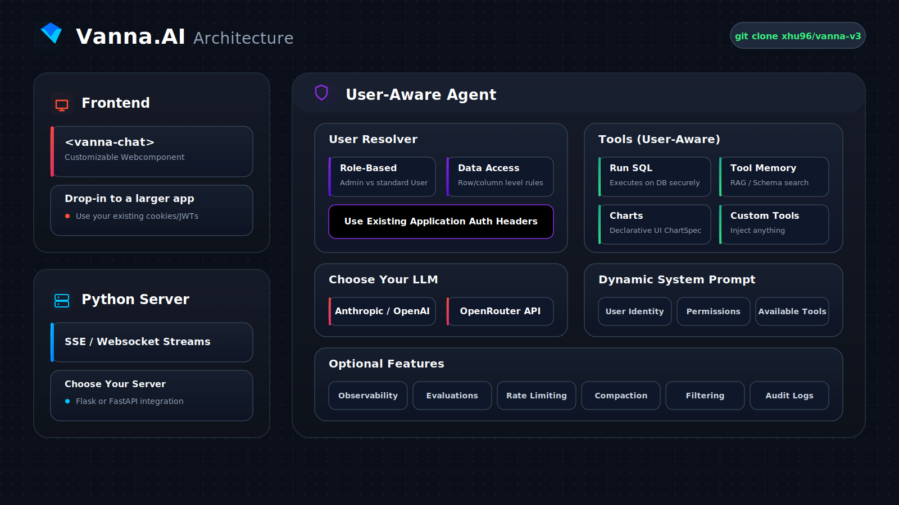
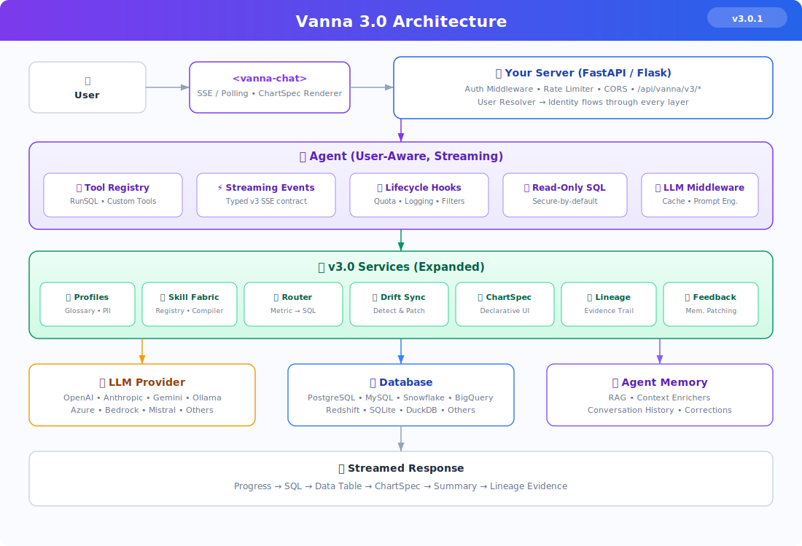
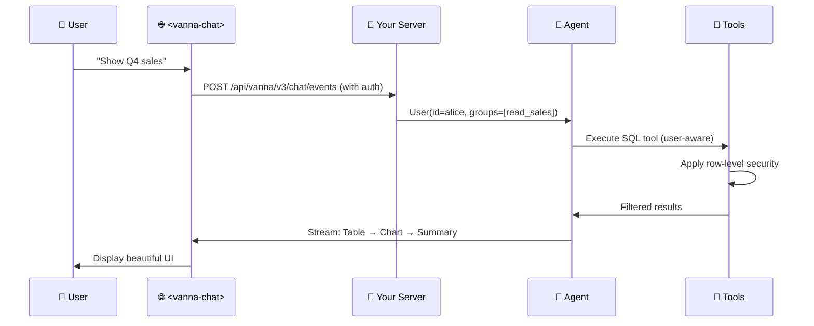

# Vanna 3: Turn Questions into Data Insights

**Natural language → SQL → Answers.** Secure-by-default, enterprise-operable, with declarative visualization, schema drift sync, semantic routing, lineage, ad-hoc skill generation, and feedback loops.

> [!IMPORTANT]
> **This is a community fork** — not the official [Vanna AI](https://github.com/vanna-ai/vanna) project. This fork builds v3 on top of the upstream v2 release, adding production-grade security, observability, and reliability features. The upstream project is maintained by the Vanna team at [vanna-ai/vanna](https://github.com/vanna-ai/vanna).

[](https://python.org)
[](LICENSE)
[](https://github.com/astral-sh/ruff)

https://github.com/user-attachments/assets/476cd421-d0b0-46af-8b29-0f40c73d6d83



---

## What's New in 3

🛡️ **Secure-by-Default** — No LLM-generated Python `exec()` for charts; read-only SQL policy; auth middleware templates

📊 **Declarative Visualization** — Validated `ChartSpec` protocol (Vega-Lite / Plotly JSON) rendered client-side

🔄 **Schema Drift Sync** — Portable INFORMATION_SCHEMA snapshots with hash-based diffing and auto memory patching

🧠 **Semantic-First Routing** — Queries route through semantic layer tools before falling back to SQL generation

📋 **Explainability & Lineage** — Every answer ships with schema version, retrieved memories, tool calls, SQL, and confidence tier

👍 **Feedback Loop** — Thumbs-down + corrected SQL immediately patches memory with weighted corrections

🔐 **User-Aware at Every Layer** — Identity, permissions, and row-level security flow through the entire system

⚡ **Typed Streaming Events** — Versioned SSE/poll event contract (`v3`) with namespaced API routes

🧩 **Declarative Skill Fabric** — Versioned, reviewable, testable skill packs that extend agent capabilities without code

👤 **Privacy-Safe Personalization** — Tenant/user profiles, glossary injection, PII redaction, and explicit consent

> **Upgrading from 0.x → 2.0?** See the [Migration Guide](MIGRATION_GUIDE.md)
>
> **Upgrading from 2.0 → 3?** See the [v2 → v3 Migration Guide](docs/v3/migration-v2-to-v3.md)

---

## Get Started

### Try it with Sample Data

[Quickstart](https://vanna.ai/docs/quick-start)

### Configure

[Configure](https://vanna.ai/docs/configure)

### Web Component

```html
<!-- Drop into any existing webpage -->
<script src="https://img.vanna.ai/vanna-components.js"></script>
<vanna-chat sse-endpoint="https://your-api.com/chat" theme="dark"> </vanna-chat>
```

Uses your existing cookies/JWTs. Works with React, Vue, or plain HTML.

---

## What You Get

Ask a question in natural language and get back:

**1. Streaming Progress Updates**

**2. SQL Code Block (By default only shown to "admin" users)**

**3. Interactive Data Table**

**4. Charts** (Plotly visualizations)

**5. Natural Language Summary**

All streamed in real-time to your web component.

---

## Why Vanna 3?

### ✅ Get Started Instantly

- Production chat interface
- Custom agent with your database
- Embed in any webpage

### ✅ Enterprise-Ready Security

**User-aware at every layer** — Identity flows through system prompts, tool execution, and SQL filtering
**Row-level security** — Queries automatically filtered per user permissions
**Audit logs** — Every query tracked per user for compliance
**Rate limiting** — Per-user quotas via lifecycle hooks

### ✅ Beautiful Web UI Included

**Pre-built `<vanna-chat>` component** — No need to build your own chat interface
**Streaming tables & charts** — Rich components, not just text
**Responsive & customizable** — Works on mobile, desktop, light/dark themes
**Framework-agnostic** — React, Vue, plain HTML

### ✅ Works With Your Stack

**Any LLM:** OpenAI, Anthropic, Ollama, Azure, Google Gemini, AWS Bedrock, Mistral, Others
**Any Database:** PostgreSQL, MySQL, Snowflake, BigQuery, Redshift, SQLite, Oracle, SQL Server, DuckDB, ClickHouse, Others
**Your Auth System:** Bring your own — cookies, JWTs, OAuth tokens
**Your Framework:** FastAPI, Flask

### ✅ Extensible But Opinionated

**Custom tools** — Extend the `Tool` base class
**Lifecycle hooks** — Quota checking, logging, content filtering
**LLM middlewares** — Caching, prompt engineering
**Observability** — Built-in tracing and metrics

---

## Architecture



---

## How It Works



**Key Concepts:**

1. **User Resolver** — You define how to extract user identity from requests (cookies, JWTs, etc.)
2. **User-Aware Tools** — Tools automatically check permissions based on user's group memberships
3. **Streaming Components** — Backend streams structured UI components (tables, charts) to frontend
4. **Built-in Web UI** — Pre-built `<vanna-chat>` component renders everything beautifully

---

## Production Setup with Your Auth

Here's a complete example integrating Vanna with your existing FastAPI app and authentication:

```python
from fastapi import FastAPI
from vanna import Agent
from vanna.servers.fastapi.routes import register_chat_routes
from vanna.servers.base import ChatHandler
from vanna.core.user import UserResolver, User, RequestContext
from vanna.integrations.anthropic import AnthropicLlmService
from vanna.tools import RunSqlTool
from vanna.integrations.sqlite import SqliteRunner
from vanna.core.registry import ToolRegistry

# Your existing FastAPI app
app = FastAPI()

# 1. Define your user resolver (using YOUR auth system)
class MyUserResolver(UserResolver):
    async def resolve_user(self, request_context: RequestContext) -> User:
        # Extract from cookies, JWTs, or session
        token = request_context.get_header('Authorization')
        user_data = self.decode_jwt(token)  # Your existing logic

        return User(
            id=user_data['id'],
            email=user_data['email'],
            group_memberships=user_data['groups']  # Used for permissions
        )

# 2. Set up agent with tools
llm = AnthropicLlmService(model="claude-sonnet-4-5")
tools = ToolRegistry()
tools.register(RunSqlTool(sql_runner=SqliteRunner("./data.db")))

agent = Agent(
    llm_service=llm,
    tool_registry=tools,
    user_resolver=MyUserResolver()
)

# 3. Add Vanna routes to your app
chat_handler = ChatHandler(agent)
register_chat_routes(app, chat_handler)

# Now you have:
# - POST /api/vanna/v2/chat_sse (streaming endpoint)
# - GET / (optional web UI)
```

**Then in your frontend:**

```html
<vanna-chat sse-endpoint="/api/vanna/v2/chat_sse"></vanna-chat>
```

See [Full Documentation](https://vanna.ai/docs) for custom tools, lifecycle hooks, and advanced configuration

---

## Custom Tools

Extend Vanna with custom tools for your specific use case:

```python
from vanna.core.tool import Tool, ToolContext, ToolResult
from pydantic import BaseModel, Field
from typing import Type

class EmailArgs(BaseModel):
    recipient: str = Field(description="Email recipient")
    subject: str = Field(description="Email subject")

class EmailTool(Tool[EmailArgs]):
    @property
    def name(self) -> str:
        return "send_email"

    @property
    def access_groups(self) -> list[str]:
        return ["send_email"]  # Permission check

    def get_args_schema(self) -> Type[EmailArgs]:
        return EmailArgs

    async def execute(self, context: ToolContext, args: EmailArgs) -> ToolResult:
        user = context.user  # Automatically injected

        # Your business logic
        await self.email_service.send(
            from_email=user.email,
            to=args.recipient,
            subject=args.subject
        )

        return ToolResult(success=True, result_for_llm=f"Email sent to {args.recipient}")

# Register your tool
tools.register(EmailTool())
```

---

## Advanced Features

Vanna 3 includes powerful enterprise features for production use:

**Lifecycle Hooks** — Add quota checking, custom logging, content filtering at key points in the request lifecycle

**LLM Middlewares** — Implement caching, prompt engineering, or cost tracking around LLM calls

**Schema Drift Sync** — Automatically detect and patch schema changes via cron-compatible scheduler

**Semantic Layer Integration** — Route queries through metrics/dimensions before falling back to raw SQL

**Lineage & Confidence** — Every answer includes provenance, evidence panel, and tiered confidence scores

**Feedback-Driven Memory** — User corrections immediately improve subsequent behavior via weighted memory patches

**Eval Harness & CI Gates** — Regression detection with configurable score delta thresholds

**Conversation Storage** — Persist and retrieve conversation history per user

**Observability** — Built-in tracing and metrics integration

**Context Enrichers** — Add RAG, memory, or documentation to enhance agent responses

**Agent Configuration** — Control streaming, temperature, max iterations, and more

### 🧩 Skill Fabric

Declarative skill packs extend agent capabilities without code or elevated permissions:

```yaml
# skill_packs/retail_ops_basics/skill.yaml
name: retail_ops_basics
version: "1.0.0"
knowledge:
  synonyms:
    revenue: [sales, turnover]
  metric_definitions:
    GMV: "SUM(order_total) WHERE status != 'cancelled'"
policies:
  required_filters: ["tenant_id = :tenant_id"]
  sql_limits:
    read_only: true
    forbid_ddl_dml: true
```

Skills follow a **governed lifecycle**: `draft → tested → approved → default` with RBAC, eval gates, and full audit logging. Two sample packs are included: `retail_ops_basics` and `uk_accounting`.

### 👤 Personalization

Privacy-safe user/tenant preferences injected deterministically into the system prompt:

```python
from vanna.personalization.preference_resolver import PreferenceResolverEnhancer

# Enhancer merges tenant defaults + user overrides + approved glossary terms
enhancer = PreferenceResolverEnhancer(profile_store, glossary_store)
agent = Agent(..., context_enhancers=[enhancer])
```

Features: PII redaction (5 types), explicit consent, data export/delete, session memory with TTL.

---

## Use Cases

**Vanna is ideal for:**

- 📊 Data analytics applications with natural language interfaces
- 🔐 Multi-tenant SaaS needing user-aware permissions
- 🎨 Teams wanting a pre-built web component + backend
- 🏢 Enterprise environments with security/audit requirements
- 📈 Applications needing rich streaming responses (tables, charts, SQL)
- 🔄 Integrating with existing authentication systems

---

## Community & Support

- 📖 **[Full Documentation](https://vanna.ai/docs)** — Complete guides and API reference
- 💡 **[GitHub Discussions](https://github.com/vanna-ai/vanna/discussions)** — Feature requests and Q&A
- 🐛 **[GitHub Issues](https://github.com/vanna-ai/vanna/issues)** — Bug reports
- 📧 **Enterprise Support** — support@vanna.ai

---

## Migration Notes

**Upgrading from Vanna 0.x?**

Vanna 2.0+ is a complete rewrite focused on user-aware agents and production deployments. See the [0.x → 2.0 Migration Guide](MIGRATION_GUIDE.md).

**Upgrading from Vanna 2.x to 3?**

Vanna 3 is an incremental evolution — v2 routes and `LegacyVannaAdapter` remain fully available. Key additions:

- **Secure-by-default**: No Python `exec()` for charts, read-only SQL policy
- **Declarative charts**: `ChartSpec` replaces code execution
- **Schema drift sync**: Portable snapshots + auto memory patching
- **Semantic routing**: Queries go through semantic tools first
- **Lineage & feedback**: Evidence panels and corrective memory patches

**Migration path:**

1. **Keep v2 routes** — Everything continues to work unchanged
2. **Switch to v3 endpoints** — Migrate to `/api/vanna/v3/` routes for typed streaming events
3. **Enable new features** — Schema sync, feedback, semantic routing

See the [v2 → v3 Migration Guide](docs/v3/migration-v2-to-v3.md) for details.

---

## Documentation

- 📐 [v3 Architecture & Design](docs/v3/architecture-and-design.md)
- 📡 [v3 API Events Reference](docs/v3/api-events-v3.md)
- 🔀 [v2 → v3 Migration Guide](docs/v3/migration-v2-to-v3.md)
- 📘 [Golden-Path Examples](examples/v3/)
- 📖 [Upstream Vanna Docs](https://vanna.ai/docs)
- 👤 [Personalization Guide](docs/v3/personalization.md)
- 📚 [Glossary & Ontology](docs/v3/glossary.md)
- 🧩 [SkillSpec Reference](docs/v3/skillspec-reference.md)
- 🔄 [Skill Lifecycle & Governance](docs/v3/skill-lifecycle.md)
- ⚙️ [Skill Generation Guide](docs/v3/skill-generation.md)
- ✍️ [Manual Skill Authoring](docs/v3/skill-authoring.md)
- 🔒 [Threat Model](docs/v3/threat-model.md)

---

## License

MIT License — See [LICENSE](LICENSE) for details.

---

**Fork maintained by [xhu96](https://github.com/xhu96)** | Based on [vanna-ai/vanna](https://github.com/vanna-ai/vanna) | [Upstream Docs](https://vanna.ai/docs)
