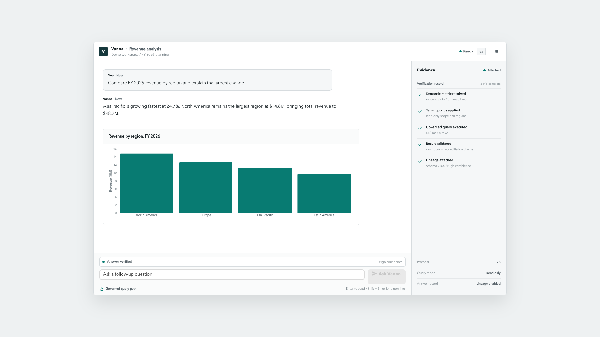
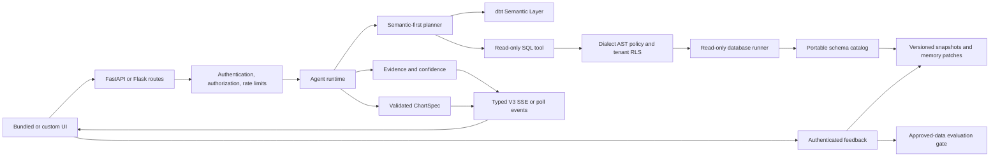

# Vanna 3.3.0

Secure natural-language analytics built on the Vanna 2.x agent runtime.

[](https://github.com/xhu96/vanna-v3/actions/workflows/tests.yml)
[](https://www.python.org/)
[](https://nodejs.org/)
[](LICENSE)

[](media/vanna-3.3-product-tour.mp4)

> [!IMPORTANT]
> This repository is a community fork of [vanna-ai/vanna](https://github.com/vanna-ai/vanna), not the official Vanna project. It retains the MIT license and upstream attribution while developing the 3.x architecture independently.

## Overview

Vanna turns natural-language questions into governed data answers. A request can be resolved through a semantic layer or a policy-enforced SQL path, then returned as typed streaming events containing text, tables, declarative charts, warnings, and reproducible lineage.

Version 3.3.0 focuses on production boundaries rather than a new agent abstraction:

- read-only SQL enforcement at the parser, tool, connection, and database-role layers;
- recursive tenant row policies across joins, CTEs, subqueries, and set operations;
- semantic-first routing through the dbt Semantic Layer GraphQL API;
- portable schema snapshots, canonical hashes, drift history, and memory updates;
- strictly validated Vega-Lite or Plotly `ChartSpec` payloads with no Python chart execution;
- typed V3 SSE and poll events with deterministic terminal behavior;
- answer lineage containing schema, retrieval, tool, query, runtime, row-count, and validation evidence;
- tenant-scoped corrective feedback with approval and offline evaluation gates;
- preserved V2 SSE, poll, and FastAPI WebSocket compatibility.

The Python and npm packages are both versioned `3.3.0`. Automated package publication remains disabled until the documented release gates are approved.

## Technology Stack

| Layer | Technology | Role |
|---|---|---|
| Runtime and models | Python 3.11-3.14, Pydantic 2 | Agent runtime, typed contracts, validation, configuration |
| HTTP servers | FastAPI, Flask, Uvicorn, ASGIRef | Namespaced V2/V3 APIs, authentication hooks, SSE and poll transports |
| Query policy | SQLGlot, SQLAlchemy | Dialect-aware parsing, read-only validation, recursive RLS, database integration |
| Data processing | pandas, tabulate | Bounded result sets, tabular serialization, answer components |
| Databases | PostgreSQL 15 reference path, SQLite, MySQL, Snowflake, BigQuery, DuckDB, ClickHouse, Oracle, SQL Server, Presto, Hive | Query execution and portable catalog ingestion through optional adapters |
| Semantic layer | dbt Semantic Layer GraphQL, HTTPX, YAML file adapter | Metric and dimension discovery, typed filters, semantic query execution |
| Schema and feedback state | Catalog snapshots, canonical JSON hashes, transactional SQLite feedback store, pluggable memory interfaces | Drift detection, corrective memory, review state, approved-data export |
| Frontend | Lit 3, TypeScript 5.9, Adobe Spectrum Web Components 1.12.2, IBM Plex | Framework-agnostic `<vanna-chat>` workbench and accessible controls |
| Visualization | JSON Schema, Vega-Lite, Vega, Plotly | Declarative charts with bounded inline data and closed safe profiles |
| Browser security | DOMPurify, sandboxed static artifacts, renderer-owned chart configuration | Active-content removal, URL restrictions, isolated artifact display |
| Quality | pytest, tox, Ruff, mypy, Vitest, Happy DOM, Playwright, Storybook | Unit, integration, typing, lint, component, browser, and security verification |
| Build and CI | Flit, Vite 6, npm lockfile, GitHub Actions, PostgreSQL 15 service container | Reproducible packages, frontend bundles, release verification, regression gates |

Frontend dependencies and fonts are bundled locally. The web component does not require a runtime component-library, font, or chart CDN.

## Architecture


```mermaid
flowchart LR
    UI["Bundled or custom UI"] --> API["FastAPI or Flask routes"]
    API --> SEC["Authentication, authorization, rate limits"]
    SEC --> AGENT["Agent runtime"]
    AGENT --> PLAN["Semantic-first planner"]
    PLAN --> DBT["dbt Semantic Layer"]
    PLAN --> SQL["Read-only SQL tool"]
    SQL --> POLICY["Dialect AST policy and tenant RLS"]
    POLICY --> DB["Read-only database runner"]
    DB --> CATALOG["Portable schema catalog"]
    CATALOG --> MEMORY["Versioned snapshots and memory patches"]
    AGENT --> LINEAGE["Evidence and confidence"]
    AGENT --> CHART["Validated ChartSpec"]
    LINEAGE --> EVENTS["Typed V3 SSE or poll events"]
    CHART --> EVENTS
    EVENTS --> UI
    UI --> FEEDBACK["Authenticated feedback"]
    FEEDBACK --> MEMORY
    FEEDBACK --> EVAL["Approved-data evaluation gate"]
```

The detailed component model, trust boundaries, performance budgets, and operational guidance are in [the V3 architecture document](docs/v3/architecture-and-design.md).

## Quick Start

### Requirements

- Python 3.11 through 3.14
- Node.js 20.19.x and npm 10 for the optional web component
- a database account restricted to read-only access for production deployments

### Install From Source

```bash
git clone https://github.com/xhu96/vanna-v3.git
cd vanna-v3

python3.11 -m venv .venv
source .venv/bin/activate
python -m pip install --upgrade pip
python -m pip install -e '.[fastapi,postgres,jwt]'
```

Run the deterministic local semantic example without an external model service:

```bash
python examples/v3/semantic_adapter_demo.py
```

For a production-oriented server configuration, start with [the FastAPI, JWT, and PostgreSQL example](examples/v3/fastapi_jwt_postgres.py). It demonstrates verified JWT identity, a read-only PostgreSQL runner, tenant row policies, production security mode, disabled default CORS/UI routes, rate limiting, schema sync, and feedback wiring.

Additional reference deployments are listed in [examples/v3](examples/v3/README.md).

### Build the Web Component

```bash
cd frontends/webcomponent
nvm use
npm ci
npm test
npm run build
```

Serve `frontends/webcomponent/dist/` from your application origin, then mount either protocol explicitly:

```html
<script type="module" src="/assets/vanna-components.js"></script>

<!-- Existing V2 behavior remains the default. -->
<vanna-chat api-version="v2"></vanna-chat>

<!-- V3 uses typed SSE or poll events. -->
<vanna-chat api-version="v3" transport="sse"></vanna-chat>
```

A custom UI can consume the same event stream without registering or serving the bundled interface. See [the BYO UI stream example](examples/v3/byo_ui_event_stream.py).

## API Contracts

| Protocol | Endpoint | Status |
|---|---|---|
| V2 SSE | `POST /api/vanna/v2/chat_sse` | Preserved |
| V2 poll | `POST /api/vanna/v2/chat_poll` | Preserved |
| V2 WebSocket | `WS /api/vanna/v2/chat_websocket` | FastAPI only; authenticated |
| V3 SSE | `POST /api/vanna/v3/chat/events` | Typed, versioned contract |
| V3 poll | `POST /api/vanna/v3/chat/poll` | Same event models and terminal rules as SSE |
| V3 feedback | `/api/vanna/v3/feedback` | Authenticated, tenant-scoped |
| V3 schema sync | `/api/vanna/v3/schema/*` | Admin-authorized by default |

V3 event envelopes carry an event version, discriminated event type, unique event ID, monotonic sequence, conversation ID, request ID, UTC timestamp, and typed payload. Every response contains exactly one terminal `done` or `error` event. There is no V3 WebSocket contract.

See [the V3 API event specification](docs/v3/api-events-v3.md) and its checked-in [JSON Schemas](docs/v3/schemas/).

## Security Model

Production mode is the default server posture:

- authenticated users are required for chat and feedback;
- admin authorization is required for schema operations and feedback review;
- CORS and bundled UI routes are disabled unless explicitly configured;
- public errors use stable codes and correlation IDs rather than raw exceptions;
- rate limiting is keyed by trusted authenticated identity;
- SQL must pass dialect-aware single-statement and read-only checks;
- protected tables require recursive, alias-qualified tenant filters;
- database runners must declare and enforce a native read-only boundary;
- chart specifications reject external URLs, scripts, expressions, arbitrary transforms, unknown properties, oversized data, and non-finite numbers;
- static artifacts render with restrictive CSP and sandboxing;
- conversation ownership is tenant-qualified and cannot be claimed by another user.

Development mode must be selected explicitly and is intended for loopback use only. These controls do not replace least-privilege database roles, network policy, secret management, or deployment-specific authorization.

## Repository Layout

```text
src/vanna/                         Python runtime, servers, policies, services, integrations
src/evals/                         Offline datasets, candidate execution, promotion gates
frontends/webcomponent/            Lit web component, Spectrum controls, tests, Storybook
examples/v3/                       Auth, RLS, semantic, schema sync, and custom UI examples
docs/v3/                           Architecture, API contracts, migration, schemas, operations
tests/                             Unit, security, integration, and inventory-controlled tests
media/                             Current workbench poster and product tour
```

## Development and Verification

Run the deterministic Python gate:

```bash
python -m pip install -e '.[dev,fastapi,flask,postgres]'
tox
```

Run frontend checks:

```bash
cd frontends/webcomponent
npm ci
npm test
npm run test:e2e
npm run build-storybook
npm audit
```

CI also runs the Python 3.11-3.14 package matrix, a PostgreSQL 15 integration job, approved-data evaluation checks, deterministic frontend builds, and artifact verification without publication.

## Compatibility and Migration

V2 remains the default frontend protocol and its existing SSE, poll, and FastAPI WebSocket payloads are preserved. V3 is opt-in through `api-version="v3"`, `protocol: "v3"`, or the V3 routes.

Important migration changes:

- Python 3.11 is the minimum supported interpreter.
- The pre-2.0 legacy adapter path is not included in this fork.
- SQL runners must expose a supported dialect and native read-only capability.
- Charts and artifacts are declarative and static; there is no executable compatibility mode.
- Production server mode requires configured authentication and authorization.

Follow the [V2 to V3 migration guide](docs/v3/migration-v2-to-v3.md) before changing an existing deployment.

## Documentation

- [V3 documentation index](docs/v3/README.md)
- [Architecture and design](docs/v3/architecture-and-design.md)
- [Typed event API](docs/v3/api-events-v3.md)
- [Migration guide](docs/v3/migration-v2-to-v3.md)
- [Implementation status](docs/v3/implementation-plan.md)
- [Reference examples](examples/v3/README.md)
- [Web component guide](frontends/webcomponent/README.md)
- [Release readiness](RELEASE_READINESS.md)
- [Upstream Vanna documentation](https://vanna.ai/docs/)

## License and Attribution

Licensed under the [MIT License](LICENSE).

This fork is based on [vanna-ai/vanna](https://github.com/vanna-ai/vanna) and preserves the upstream package names and attribution. Vanna and associated upstream branding belong to their respective owners.
