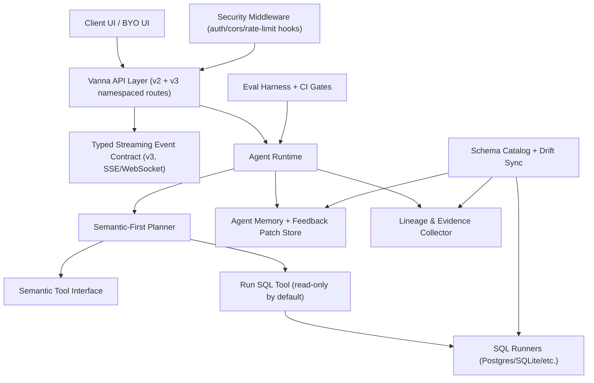

# Vanna v3.0 Architecture and Design

## 1) Objectives
- Deliver a production-grade v3.0 that is secure-by-default, enterprise-operable, and more reliable than v2.x.
- Preserve a migration path for v2.x users (legacy APIs and adapter path remain supported with explicit deprecations).

## 2) Component Architecture

## 3) Data Models

### 3.1 Streaming Event Envelope (v3)
- `event_version`: fixed string (`"v3"`).
- `event_type`: enum, e.g. `status`, `tool_start`, `tool_result`, `assistant_text`, `table_result`, `chart_spec`, `lineage`, `warning`, `error`, `done`.
- `conversation_id`, `request_id`, `timestamp`.
- `payload`: typed event payload.

### 3.2 ChartSpec
- `format`: `vega-lite` (preferred) or `plotly-json`.
- `schema_version`: e.g. Vega-Lite schema URL or plotly schema marker.
- `spec`: validated JSON object.
- `dataset`: inline rows or reference token.
- `metadata`: row_count/column_count/source.

### 3.3 Schema Catalog
- `snapshot_id`, `captured_at`, `schema_hash`, `dialect`.
- `entities`: database/schema/table/column descriptors.
- `diff`: added/removed/changed entities.

### 3.4 Semantic Query
- `metric`, `dimensions`, `filters`, `time_grain`, `limit`, `order_by`.
- `semantic_coverage`: full/partial/missing.

### 3.5 Lineage / Evidence
- `schema_snapshot_id`, `schema_hash`.
- `retrieved_memories`: IDs + scores.
- `tool_calls`: name/args/result metadata/durations.
- `executed_sql`: normalized SQL + row_count + runtime.
- `validation_checks`: passed/failed checks.
- `confidence`: `High` / `Medium` / `Low` from explicit rules.

### 3.6 Feedback
- `feedback_id`, `conversation_id`, `request_id`, `rating`.
- `reason_codes`, `corrected_sql`, `user_edits`.
- `memory_patch`: positive/negative/corrective weight + provenance.
- `review_status`: pending/approved/rejected (for optional golden queue).

## 4) API Contract (Versioned Streaming)

### v3 Routes (namespaced, configurable)
- `POST /api/vanna/v3/chat/events` (SSE typed events)
- `POST /api/vanna/v3/chat/poll` (typed event batch)
- `POST /api/vanna/v3/feedback`
- `POST /api/vanna/v3/schema/sync`
- `GET /api/vanna/v3/schema/status`

### v2 Compatibility
- Existing v2 endpoints remain available.
- v2 payload remains unchanged.
- A compatibility adapter translates v3 typed events to v2 chunk format when needed.

## 5) Threat Model and Mitigations

### Threats
- LLM-generated code execution for visualization.
- SQL data mutation/exfiltration.
- Over-permissive CORS and unauthenticated access.
- Cross-tenant data leakage via tool misuse.
- Prompt injection causing unsafe tool calls.

### Mitigations
- No default chart path executes Python code.
- Run SQL defaults to read-only statement classes.
- Tool access groups + query-layer validation hooks.
- Safe CORS defaults (`allow_origins` explicit, non-wildcard by default).
- Auth middleware templates for JWT/OAuth gateway handoff.
- Rate-limit hook points at API layer.
- Event payload validation and strict ChartSpec schema validation.

## 6) Migration and Compatibility Plan (v2 -> v3)
- Keep v2 routes and `LegacyVannaAdapter` available.
- Introduce v3 routes and typed events without forcing default UI adoption.
- Legacy visualization behavior becomes opt-in (admin-only “power mode”) with explicit risk warnings.
- Provide migration doc with code snippets:
  - v2 client -> v3 events.
  - legacy chart generation -> ChartSpec.
  - legacy `ask()` visualization behavior -> secure defaults + opt-in override.

## 7) Performance Budgets
- P95 first streamed event: < 1.2s for local tools.
- P95 non-streaming completion (simple query): < 6s (DB-dependent).
- Additional v3 lineage overhead: < 5% runtime.
- Schema drift sync over 1k tables: < 60s snapshot pass on Postgres baseline.

## 8) Operational Guidance
- Run schema sync on a schedule (cron/worker) + on-demand endpoint.
- Persist lineage and feedback in durable storage in production.
- Enable read-only DB roles by default.
- Set authentication middleware in front of API for multi-tenant deployments.
- Gate offline training artifacts with eval harness pass/fail thresholds.

## 9) v3 Feature Mapping to Existing v2 Modules (Minimal Invasive Strategy)
- Streaming contract:
  - Existing: `src/vanna/servers/base/models.py`, `src/vanna/servers/*/routes.py`
  - v3 add: typed event models + v3 routes; keep v2 handlers.
- Visualization:
  - Existing: `src/vanna/tools/visualize_data.py`, `frontends/webcomponent/src/components/rich-component-system.ts`
  - v3 add: ChartSpec schema validation + declarative renderer path.
- Schema drift:
  - Existing: SQL runners in `src/vanna/integrations/*/sql_runner.py`
  - v3 add: schema snapshot/diff/scheduler service that reuses SQL runners.
- Semantic layer:
  - Existing: tool registry/agent loop.
  - v3 add: semantic tool interface and semantic-first planner helper.
- Explainability/lineage:
  - Existing: agent loop + tool registry metadata.
  - v3 add: lineage collector and end-of-response lineage event/component.
- Feedback loop:
  - Existing: agent memory interfaces/tools.
  - v3 add: feedback API + immediate corrective memory patching + review queue.

