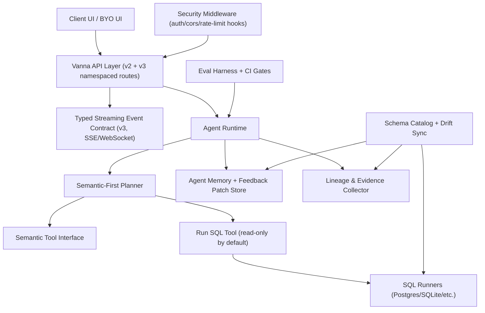

# Vanna v3 Architecture and Design

## 1) Objectives

- Deliver a production-grade v3.2 that is secure-by-default, enterprise-operable, and more reliable than v2.x.
- Preserve a migration path for v2.x users (legacy APIs and adapter path remain supported with explicit deprecations).

## 2) Component Architecture

```mermaid
flowchart TD
    Client["Client UI / BYO UI"] --> API["Vanna API Layer (v2 + v3 namespaced routes)"]
    API --> Stream["Typed Streaming Event Contract (v3, SSE/WebSocket)"]
    API --> Agent["Agent Runtime"]
    Agent --> Planner["Semantic-First Planner"]
    Planner --> SemanticTool["Semantic Tool Interface"]
    Planner --> SQLTool["Run SQL Tool (read-only by default)"]
    Agent --> Memory["Agent Memory + Feedback Patch Store"]
    Agent --> Lineage["Lineage & Evidence Collector"]
    SQLTool --> DB["SQL Runners (Postgres/SQLite/etc.)"]
    Drift["Schema Catalog + Drift Sync"] --> DB
    Drift --> Memory
    Drift --> Lineage
    Eval["Eval Harness + CI Gates"] --> Agent
    Security["Security Middleware (auth/cors/rate-limit hooks)"] --> API
```

## 3) Data Models

### 3.1 Streaming Event Envelope (v3)

- `event_version`: fixed string (`"v3"`).
- `event_type`: enum, e.g. `status`, `tool_start`, `tool_result`, `assistant_text`, `table_result`, `chart_spec`, `lineage`, `warning`, `error`, `done`.
- `conversation_id`, `request_id`, `timestamp`.
- `payload`: typed event payload.

### 3.2 ChartSpec

- `format`: `vega-lite` (preferred) or `plotly-json`.
- `schema_version`: e.g. Vega-Lite schema URL or plotly schema marker.
- `spec`: validated JSON object.
- `dataset`: inline rows or reference token.
- `metadata`: row_count/column_count/source.

### 3.3 Schema Catalog

- `snapshot_id`, `captured_at`, `schema_hash`, `dialect`.
- `entities`: database/schema/table/column descriptors.
- `diff`: added/removed/changed entities.

### 3.4 Semantic Query

- `metric`, `dimensions`, `filters`, `time_grain`, `limit`, `order_by`.
- `semantic_coverage`: full/partial/missing.

### 3.5 Lineage / Evidence

- `schema_snapshot_id`, `schema_hash`.
- `retrieved_memories`: IDs + scores.
- `tool_calls`: name/args/result metadata/durations.
- `executed_sql`: normalized SQL + row_count + runtime.
- `validation_checks`: passed/failed checks.
- `confidence`: `High` / `Medium` / `Low` from explicit rules.

### 3.6 Feedback

- `feedback_id`, `conversation_id`, `request_id`, `rating`.
- `reason_codes`, `corrected_sql`, `user_edits`.
- `memory_patch`: positive/negative/corrective weight + provenance.
- `review_status`: pending/approved/rejected (for optional golden queue).

## 4) API Contract (Versioned Streaming)

### v3 Routes (namespaced, configurable)

- `POST /api/vanna/v3/chat/events` (SSE typed events)
- `POST /api/vanna/v3/chat/poll` (typed event batch)
- `POST /api/vanna/v3/feedback`
- `POST /api/vanna/v3/schema/sync`
- `GET /api/vanna/v3/schema/status`

### v2 Compatibility

- Existing v2 endpoints remain available.
- v2 payload remains unchanged.
- A compatibility adapter translates v3 typed events to v2 chunk format when needed.

## 5) Threat Model and Mitigations

### Core Threats & Mitigations

| Threat | Mitigation |
|--------|------------|
| LLM-generated code execution for visualization | No default chart path executes Python code; `ChartSpec` validates payloads |
| SQL data mutation/exfiltration | Run SQL defaults to read-only statement classes; DDL/DML banned |
| Over-permissive CORS and unauthenticated access | Safe CORS defaults (explicit `allow_origins`, non-wildcard); auth middleware templates |
| Cross-tenant data leakage via tool misuse | Tool access groups + query-layer validation hooks; `required_filters` enforces tenant predicates |
| Prompt injection causing unsafe tool calls | Rate-limit hook points at API layer; event payload validation |

### Personalization & Skill Fabric Threats

#### 5.1 Prompt Injection into Skill Generator

| | |
|---|---|
| **Threat** | Attacker crafts a malicious `description` input that causes the LLM to generate a skill spec with elevated privileges, bypassed policies, or hidden intents |
| **Impact** | A dangerous skill draft could be created |
| **Mitigations** | Generator output is always set to `draft` environment — it cannot auto-publish. All generated specs are validated by the deterministic **SkillCompiler** (no LLM in compiler path). Compiler rejects write SQL, missing tenant predicates, unknown tools. Promotion requires passing eval suite + RBAC-gated approval. Audit log records all generation requests |

#### 5.2 Data Exfiltration via Skills

| | |
|---|---|
| **Threat** | A skill spec is designed to extract data from unauthorized tables or exfiltrate via tool routing hints |
| **Impact** | Unauthorized data access |
| **Mitigations** | Skills can only ADD policy constraints, never remove them. `required_filters` enforces tenant isolation predicates. `tool_allowlist/denylist` scopes accessible tools. SQL limits enforce `read_only`, `max_rows`, `LIMIT` requirement, and DDL/DML ban. Skills cannot elevate access beyond user's effective `group_memberships`. Row/column redaction rules provide fine-grained access control |

#### 5.3 Unauthorized Skill Promotion

| | |
|---|---|
| **Threat** | Non-admin user promotes a skill from draft directly to production |
| **Impact** | Untested or malicious skill enters production pipeline |
| **Mitigations** | Ordered state machine enforces sequential promotion: `draft → tested → approved → default`. Promotion beyond draft requires membership in `allow_skill_publish_roles` (default: `admin`). Promotion to `approved` or `default` requires eval suite passing thresholds. All state transitions are audit-logged with actor, timestamp, and source/target environment |

#### 5.4 Privacy Risks of User Preference Storage

| | |
|---|---|
| **Threat** | Sensitive personal information (PII) is stored in user profiles or glossary entries |
| **Impact** | Data breach exposure, GDPR/CCPA compliance risk |
| **Mitigations** | **PII redaction** runs on all text before durable storage. **Explicit opt-in** required: `personalization_enabled` must be True on both tenant and user profiles. **Storage policy checker** rejects raw query results in profiles. User can **export** and **delete** all stored data (GDPR compliance). Session memory is **ephemeral** with configurable TTL. Profile fields are **explicit** (no free-form blobs) |

#### 5.5 Skill Bypass of Existing Guardrails

| | |
|---|---|
| **Threat** | A skill changes tool permissions or removes existing security guardrails |
| **Impact** | Existing security model is undermined |
| **Mitigations** | Skills contribute context through the existing `transform_args` pipeline — they cannot modify the pipeline itself. `ToolRegistry._validate_tool_permissions` continues to enforce user `group_memberships`. Skills can only restrict (denylist tools, add required filters) — never expand access. Compiled skills are deterministic artifacts — no runtime code execution in the skill path |

#### 5.6 Session Memory Leakage

| | |
|---|---|
| **Threat** | Session memory entries persist beyond intended lifetime |
| **Impact** | Stale or sensitive context available to future interactions |
| **Mitigations** | All session memories have explicit `expires_at` timestamp. `SessionMemoryStore.cleanup_expired()` removes expired entries. Configurable retention period via `session_memory_retention_days`. PII redaction applied before storage |

## 6) Migration and Compatibility Plan (v2 -> v3)

- Keep v2 routes and `LegacyVannaAdapter` available.
- Introduce v3 routes and typed events without forcing default UI adoption.
- Legacy visualization behavior becomes opt-in (admin-only “power mode”) with explicit risk warnings.
- Provide migration doc with code snippets:
  - v2 client -> v3 events.
  - legacy chart generation -> ChartSpec.
  - legacy `ask()` visualization behavior -> secure defaults + opt-in override.

## 7) Performance Budgets

- P95 first streamed event: < 1.2s for local tools.
- P95 non-streaming completion (simple query): < 6s (DB-dependent).
- Additional v3 lineage overhead: < 5% runtime.
- Schema drift sync over 1k tables: < 60s snapshot pass on Postgres baseline.

## 8) Operational Guidance

- Run schema sync on a schedule (cron/worker) + on-demand endpoint.
- Persist lineage and feedback in durable storage in production.
- Enable read-only DB roles by default.
- Set authentication middleware in front of API for multi-tenant deployments.
- Gate offline training artifacts with eval harness pass/fail thresholds.

## 9) v3 Feature Mapping to Existing v2 Modules (Minimal Invasive Strategy)

- Streaming contract:
  - Existing: `app/base/models.py`, `app/*/routes.py`
  - v3 add: typed event models + v3 routes; keep v2 handlers.
- Visualization:
  - Existing: `src/vanna/tools/visualize_data.py`, `static/vanna-components.js`
  - v3 add: ChartSpec schema validation + declarative renderer path.
- Schema drift:
  - Existing: SQL runners in `src/vanna/integrations/*/sql_runner.py`
  - v3 add: schema snapshot/diff/scheduler service that reuses SQL runners.
- Semantic layer:
  - Existing: tool registry/agent loop.
  - v3 add: semantic tool interface and semantic-first planner helper.
- Explainability/lineage:
  - Existing: agent loop + tool registry metadata.
  - v3 add: lineage collector and end-of-response lineage event/component.
- Feedback loop:
  - Existing: agent memory interfaces/tools.
  - v3 add: feedback API + immediate corrective memory patching + review queue.
