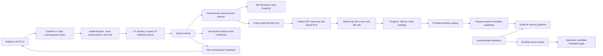

# Vanna 3.3.0 Architecture and Design

Status: implemented release contract as of 2026-08-12. Live PostgreSQL 15,
live dbt tenant compatibility, exact Node 20.19 execution, and fresh Python
artifacts remain release checks and are not claimed as locally verified.

## Goals

- Preserve Vanna 2.x routes and web-component behavior by default.
- Add an explicit, versioned V3 SSE and poll contract for default and BYO UIs.
- Make authentication, authorization, read-only SQL, tenant policy, CORS,
  throttling, public errors, and visualization safe in the default production
  configuration.
- Prefer a catalogued semantic query over generated SQL and make every fallback
  visible.
- Make schema state, evidence, feedback, and eval decisions reproducible and
  tenant-scoped.
- Keep the `vanna` and `@vanna/webcomponent` package names and use the next
  available public version, `3.3.0`.

## Non-Goals

- V3 WebSocket is not part of the stable contract. FastAPI keeps and repairs
  the V2 WebSocket; Flask explicitly returns `501` for V2 WebSocket.
- Core V3 has no Python chart execution or executable artifact mode.
- Event-driven database hooks are optional accelerators, never a requirement
  for schema drift detection.
- This branch does not publish packages or move tags. The divergent public
  `v3.2.0` line must be reconciled before `v3.3.0` can be published.

## Components

```mermaid
flowchart LR
    UI["Default or BYO UI"] --> API["FastAPI or Flask namespaced routes"]
    API --> SEC["Authentication, route authorization, rate limit"]
    SEC --> EVT["V2 chunks or typed V3 SSE/poll events"]
    EVT --> AGENT["Agent runtime"]
    AGENT --> PLAN["Deterministic semantic-first planner"]
    PLAN --> DBT["dbt Semantic Layer GraphQL"]
    PLAN --> SQL["Policy-enforced SQL tool"]
    SQL --> POLICY["Dialect AST read-only and tenant RLS"]
    POLICY --> RUNNER["Read-only DB runner and DB role"]
    RUNNER --> DB["Postgres, SQLite, other catalogs"]
    DB --> CATALOG["Portable schema catalog"]
    CATALOG --> SNAP["Tenant-scoped immutable snapshots"]
    SNAP --> MEMORY["Schema memory patches"]
    AGENT --> LINEAGE["Structured evidence and confidence"]
    AGENT --> CHART["Strict declarative ChartSpec"]
    CHART --> UI
    FEEDBACK["Authenticated feedback"] --> MEMORY
    FEEDBACK --> REVIEW["Durable review queue"]
    REVIEW --> EVAL["Approved candidate evaluation gate"]
```

## Trust Boundaries

1. **Browser to route boundary.** Headers, cookies, query parameters, request
   IDs, conversation IDs, feedback, and chart input are untrusted. The route
   resolves identity, checks the route action, applies a trusted rate-limit
   identity, bounds payloads, and creates a server-side request context.
2. **Agent to tool boundary.** LLM text and tool arguments are untrusted. The
   registry enforces the offered-tool allowlist and group access again at
   execution time. Tool implementations cannot bypass query policy.
3. **SQL to database boundary.** SQL is parsed with an explicit dialect, must
   be a single allowlisted read-only statement, receives recursive tenant
   predicates, and executes using a read-only connection/transaction and DB
   role. Parse ambiguity fails closed.
4. **Semantic service boundary.** Adapter metadata and results are external
   data. Only catalogued metrics, dimensions, grains, operators, and typed
   values become GraphQL variables. Tokens and upstream diagnostics are never
   serialized to clients.
5. **Persistence boundary.** Tenant scope is derived from authenticated user
   context, not request metadata. Snapshot, feedback, conversation, memory, and
   review stores enforce owner/scope checks independently of routes.
6. **Renderer boundary.** Model-controlled text is rendered as text or
   sanitized markdown. ChartSpec is validated server-side and client-side.
   Static HTML artifacts use a restrictive CSP and an empty iframe sandbox;
   JavaScript artifacts render as source text and never execute. The optional
   bundled page contains one same-origin module script, no inline JavaScript,
   and no remote font, runtime, component, login, or artifact-execution path. Its
   route response applies a closed CSP and browser hardening headers in both
   frameworks.

## Secure Server Modes

`security_mode` is `production` or `development` and defaults to
`production`.

| Control | Production default | Development default |
|---|---|---|
| Authenticated user | Required | Anonymous resolver allowed only after explicit development selection |
| Bind guidance | Deployment-specific, never implied public | Loopback only |
| CORS | Disabled | Disabled; explicit loopback origins may be configured |
| Bundled UI route | Disabled | Enabled only when requested; assets remain same-origin |
| Rate limiting | Principal-scoped fixed window, 120 requests/minute unless a stricter hook is configured | Explicit development policy |
| Chat and feedback authorization | Authenticated | Explicit development policy |
| Schema sync/status and feedback review | `admin` | `admin` unless an explicit development authorizer overrides it |
| Public exceptions | Stable redacted envelope | Stable redacted envelope; internal logs retain correlation only |

`User.authenticated` is a backward-compatible model field with default `True`
so existing non-server integrations can still construct `User` objects. This
default is not proof of authentication. In production mode, the route boundary
requires the resolver to have explicitly set the field; an omitted/defaulted
value is rejected with `401`. The built-in anonymous resolver explicitly
returns `False`. Applications must return an explicit value during migration.

`RouteAuthorizer.authorize(action, user, context)` is invoked for every
sensitive route and WebSocket handshake. Default actions are:

- `chat:execute` and `feedback:create`: authenticated user.
- `schema:read`, `schema:sync`, `feedback:review`, and `feedback:export`:
  authenticated member of `admin`.
- `ui:read`: disabled in production unless configured.

The authorizer is an extension point, not the only enforcement layer. Principal
validation rejects empty subjects and malformed supplied tenant claims. An
absent tenant claim maps to the explicit `tenant:default` single-tenant scope
for V2 compatibility; multi-tenant row-policy providers, including the golden
Postgres example, independently require a verified tenant claim and fail closed
when it is absent.

## Component Mapping

| Capability | Baseline state | Current implementation and remaining gate |
|---|---|---|
| Agent/runtime | V2 agent loop is established | Implemented: deterministic semantic policy, request-wide lineage finalization, and terminal hooks retain normal V2 chunks |
| Tool permissions | Group checks exist in `src/vanna/core/registry.py` | Implemented: per-turn offered-tool and capability allowlists are enforced again during execution; SQL and semantic SQL share `SqlQueryPolicy` |
| SQL read-only | Baseline has partial AST checks | Implemented: dialect-aware `ReadOnlySqlPolicy`, tenant-aware `SqlQueryPolicy`, default-required row policies and native read-only runner capability, SQLite `mode=ro`, and PostgreSQL read-only transactions; built-in runners move blocking driver work off the event loop, enforce 5,000-row/2-MiB/30-second defaults, and fetch in bounded batches; unknown/UDF functions require an explicit allowlist and dangerous file readers remain denied; the real least-privilege PostgreSQL role test remains mandatory CI and locally `NOT VERIFIED` |
| RLS | Baseline helper filtered only the outer query | Implemented: scope-aware source wrappers filter joins, CTEs, derived/correlated subqueries, and every set arm; every physical source must match a row policy or the explicit `allowed_unfiltered_tables` allowlist, and unknown or ambiguous sources fail closed |
| FastAPI/Flask | Implemented: V2 paths retained; common typed V3 SSE/poll producer, canonical IDs, public errors, custom prefixes, and framework parity tests | Keep V2 golden fixtures and live proxy buffering/cancellation checks in the release gate |
| Events | Implemented: strict discriminated payloads, RFC 3339 UTC timestamps, sequence/ID state machine, complete SSE frames, poll terminal separation, globally unique event IDs, exact done event counts, exactly one lineage event as the final non-terminal event, and conversion/serialization budget tests | Keep proxy buffering and disconnect cancellation in the live release gate |
| Frontend | Implemented: `protocol: "v2|v3"`, `<vanna-chat api-version="v2|v3">`, V2 default, framed UTF-8 SSE parser, closed V3 validation, normalization, explicit poll, cancellation, and no replay; the optional server page self-hosts one validated same-origin module under a restrictive CSP | Keep deterministic bundle, Storybook, Chromium security, and V2 WebSocket fixtures in the release gate |
| Conversation ownership | Baseline stores returned foreign IDs as missing and allowed unscoped upserts | Implemented: routes atomically claim IDs before hooks, workflows, or model calls and return pre-stream `403` on denial; built-in stores preserve immutable ownership and append concurrent same-owner deltas without lost updates; filesystem directories/files are tightened to `0700`/`0600`; production rejects stores without atomic ownership and update capabilities |
| Visualization | Implemented: versioned strict `ChartSpec`, bounded inline data, safe Vega-Lite/Plotly subsets, and no executable chart path | Keep browser renderer probes and packaged-schema verification in the release gate |
| Artifacts | Implemented: static allowlisted HTML, restrictive CSP, empty iframe sandbox, no popup/network path, and JavaScript as source text | Keep browser isolation probes and production dependency audit in the release gate |
| Schema drift | Implemented: explicit SQLite/`INFORMATION_SCHEMA` adapters with required trusted schema/table source allowlists, tenant-keyed transactional storage, monotonic versions, immutable history, delimiter-safe entity IDs, durable schedule claims, and memory outbox | Verify the PostgreSQL 1,000-table budget and deployment-specific catalog permissions in the integration gate |
| Semantic layer | Implemented: dbt GraphQL adapter, catalog coverage, fail-closed upstream errors, capability-based SQL removal, and shared policy execution for file SQL | Verify the configured dbt GraphQL schema against a live tenant before production rollout; deterministic mocked HTTP remains the offline gate |
| Lineage | Implemented: strict serializable evidence, canonical IDs, schema/semantic/tool/query/check records, permission-filtered detail, and deterministic confidence on all terminal paths | Verify reference Postgres overhead below five percent in the live integration gate |
| Feedback | Implemented: async-safe transactional SQLite I/O, tenant/user provenance, shared-policy SQL validation, tenant-visible keyed suppression/correction patches, retryable review-memory outbox state, terminal review lifecycle, and digest-addressed approved-only generations committed by an atomic manifest-last marker | Inject an enterprise shared store for multi-host deployments |
| Evals | Implemented: freshly re-executed supplied candidate stack, six original/held-out catalog-driven policy/result-isolation cases with planted cross-tenant outliers and mandatory RLS, dataset-bound aggregate/slice metrics, fail-closed execution/artifact comparison, approved-export provenance, regression check mode, and improvement-only promotion mode; this fixture is not a broad generative NL-to-SQL benchmark | Run candidate training outside the server process and retain immutable artifacts |

## Data Models

### Identity and Scope

`User` retains `id`, profile fields, metadata, and groups, and adds:

- `authenticated: bool`.
- Tenant scope resolved through a configured resolver, conventionally from a
  trusted claim such as `user.metadata["tenant_id"]`.

Internal `TenantScope` contains `tenant_id` and `user_id`. It is never accepted
from an untrusted request body. Store keys include tenant scope before any
caller-provided identifier.

Public chat metadata is JSON-only and bounded to 64 KiB, depth 8, 100 items per
container, and 4,096-character strings. Reserved schema-lineage keys and every
`_vanna_` key are rejected recursively. Routes inject trusted schema lineage in
the server-owned `_vanna_schema_lineage` object only after validation.

### V3 Event

The event is a discriminated Pydantic model matching
`docs/v3/schemas/chat-events-v3.schema.json`:

- `event_version`: literal `v3`.
- `event_type`: `status`, `assistant_text`, `table_result`, `chart_spec`,
  `component`, `warning`, `lineage`, `error`, or `done`.
- `event_id`: opaque unique ID, also used as the SSE `id` field.
- `sequence`: zero-based, strictly increasing within one request.
- `conversation_id`, `request_id`: non-empty server-canonical IDs.
- `timestamp`: RFC 3339 UTC timestamp.
- `payload`: event-specific model with unknown fields rejected.

See `docs/v3/api-events-v3.md` for terminal and transport rules.

### ChartSpec

The public fields remain `format`, `schema_version`, `spec`, `dataset`, and
`metadata`. `docs/v3/schemas/chart-spec-v1.schema.json` defines the safe
profile.

- Vega-Lite is pinned to a safe V5 single-view subset. External data, signals,
  params, expressions, arbitrary transforms, composition, and unknown fields
  are rejected.
- Plotly supports allowlisted `bar`, `scatter`, and `pie` traces and bounded
  layout fields. Client-controlled Plotly config is rejected; renderer-owned
  safe config is applied last.
- Inline data accepts only JSON scalars and finite numbers, at most 5,000 rows,
  100 fields per row, and 2 MiB serialized.
- Core V3 emits bounded inline datasets only. Deployments that need larger
  datasets must add a separate authenticated application contract rather than
  placing unresolved references or URLs in `ChartSpec`.

### Schema Catalog

`SchemaSnapshot` contains:

- `tenant_id`, opaque immutable `snapshot_id`, monotonic integer
  `schema_version`, canonical `schema_hash`, UTC `captured_at`, and `dialect`.
- Canonically ordered schema/table/column descriptors, including ordinal, type,
  and nullability.

`SchemaSnapshotStore` provides atomic compare-and-write, `latest`, history, and
`get(snapshot_id)` operations. A canonical hash match is idempotent and does
not increment the version. The local implementation uses SQLite WAL plus
`BEGIN IMMEDIATE`, immutable snapshot triggers, parameterized tenant keys, and
a durable memory-patch outbox. Enterprise stores implement the same atomic
contract in their database.

Catalog source scope is independent from the snapshot tenant key. PostgreSQL
and other `INFORMATION_SCHEMA` adapters require an explicit trusted schema
allowlist; SQLite requires an explicit table allowlist. Configuration can
provide a static collection or a callable resolved against authenticated
`ToolContext`; trusted user metadata is the only fallback. Public request
metadata cannot widen discovery. `require_catalog_scope=False` is a documented
single-tenant migration override, not a production default.

`SchemaDiff` identifies added, removed, and changed columns. Drift patching
writes tenant-scoped schema upserts and tombstones with snapshot/hash/version
provenance. Each entity is addressed by a stable logical memory key; a change
replaces the previous representation and a removal replaces it with a single
current tombstone instead of accumulating contradictory records. Workers claim
outbox records exclusively; failed memory writes are released for retry rather
than acknowledged. A backend without tenant-scoped keyed text-memory upsert
support is rejected while patches remain pending. Entity IDs percent-encode each
schema, table, and column component before joining with dots, so a literal dot in
an identifier cannot collide with a structural separator. Existing simple IDs such
as `public.orders.id` remain unchanged; `a.b.c.d`-ambiguous components become
`a%2Eb.c.d` or `a.b%2Ec.d` and remain distinct through snapshot persistence and
memory patching.

### Semantic Query

The stable interface remains `SemanticAdapter.plan` and
`SemanticAdapter.execute`. The query model supports:

- one or more metric names;
- catalogued dimensions;
- equality/range filters composed from typed values, never caller-provided raw
  `where` SQL;
- validated time grain, ordering, and bounded limit.

Coverage is `full`, `partial`, or `missing`. Full coverage removes `run_sql`
from both the tool schemas offered to the model and the execution allowlist.
Partial/missing coverage enables SQL with a typed warning. Semantic service
failure is an error by default; fallback on outage requires an explicit policy
and still emits a warning.

File-backed semantic SQL and automatic schema-catalog SQL require a runner whose
`native_read_only` capability is exactly `True`. The SQLite, PostgreSQL, and
file-backed DuckDB integrations can establish this capability in their
read-only configurations. Other/custom runners are refused by the default
model-facing query, semantic-file, and catalog paths until the deployment
provides a native read-only boundary or deliberately selects the documented
legacy migration override. That override never disables AST or tenant policy.

`DbtSemanticLayerAdapter` uses an injected async HTTP client and token provider,
fetches paginated metadata, submits a query, polls with both a deadline and an
attempt bound, and parses bounded paginated JSON results. Query documents are
constant; catalogued identifiers and typed values are sent only as GraphQL
variables. HTTPS is mandatory. Each request overrides injected-client redirect
defaults, rejects `30x` before a body can be replayed, and streams response bytes
through the configured bound before JSON parsing. Secrets and upstream GraphQL
diagnostics are redacted.

The adapter contract and failure behavior are verified offline with deterministic
mocked HTTP. The exact GraphQL schema available to a deployment is dbt account
and API-version dependent, so a pre-production catalog/query probe against the
configured tenant remains an operational gate rather than an offline test claim.

### Lineage and Confidence

`LineageEvidence` is a serializable typed model containing:

- request/conversation identity and terminal outcome;
- schema version, snapshot ID, hash, and drift status;
- retrieved memory/document IDs, source, and bounded relevance signals;
- offered route, semantic coverage/fallback reason, and tool records;
- SQL after policy, dialect, runtime, row count, and validation checks;
- redaction decisions and confidence tier.

The public serializer receives the requesting user's permissions. SQL text,
tool arguments, memory text, and internal errors are omitted unless explicitly
allowed. IDs and aggregate timings remain available for reproducibility.

Confidence is `High`, `Medium`, or `Low`, never a percentage. Rules use explicit
signals: semantic coverage, retrieval support, self-consistency, successful
post-query validation, schema freshness, and tool errors. Missing evidence or
any relevant error can only lower confidence. The V3 sequence layer permits
exactly one lineage event as the final non-terminal event immediately before
`done` or `error`; SSE and poll reject any later content. If an accepted agent stream
omits lineage, the server emits a synthetic Low-confidence record with a failed
`agent_lineage_emitted` check; empty and failed generators therefore still
produce reproducible evidence rather than a lineage-free terminal.

### Feedback and Review

`FeedbackRecord` includes tenant/user ownership, question and normalized SQL
hashes, rating, reason codes, optional validated correction, edits, request and
conversation provenance, timestamps, and `pending|approved|rejected` review
state.

The default `FeedbackStore` is transactional SQLite. Immediate patching:

- thumbs-down writes a negative patch that suppresses the same normalized SQL
  for similar questions;
- a policy-validated correction writes a high-priority corrective patch that
  deterministically outranks the rejected candidate on the next retrieval;
- all retrieval and writes are tenant-scoped.

Feedback retries require `AgentMemory.upsert_tool_usage(..., memory_key=...)`
and `supports_keyed_tool_memory_upsert = True`. Each negative/corrective patch
uses a stable feedback-derived key, completed operations are recorded in the
transactional outbox, and append-only backends are rejected before feedback is
persisted. A review transition is not visible or allowed until every initial
memory patch is durably marked applied, preventing a late pending write from
overwriting an approval or rejection. The reference export is bounded to 250 approved records and 64 MiB
per request; larger training corpora must use a reviewed streaming enterprise
exporter.

Local training export writes owner-only same-directory temporary files, flushes
and fsyncs their exact bytes, atomically replaces the destination, and publishes
the manifest last as the commit marker. A crash between replacements leaves a
digest mismatch that the loader rejects instead of accepting a mixed pair.

Training export reads approved records only and emits a provenance manifest.
Promotion requires the exact approved JSONL bytes whose SHA-256, record count,
ordered IDs, tenant scope, and typed records match that manifest. It also
requires no aggregate or per-slice regression and improvement in at least one
fixed quality metric. Missing, NaN, infinite, out-of-range, arithmetically
inconsistent, or unexpected-candidate metrics fail the gate.

The eval runner accepts a concrete `AgentVariant` in-process or an explicit
local `module:callable` factory on the CLI. Candidate metrics bind the dataset
name, exact SHA-256, case count, aggregate results, and a partition of fixed
slices. The checked candidate traverses the real agent, registry, SQL tool,
query policy, and native read-only SQLite runner, while trajectory scoring
requires successful tool execution recorded in lineage. CI executes
`--mode promote` against a checked approved-only fixture, while `--mode check`
remains available for non-promotion regression diagnostics. Promotion
additionally requires a non-empty
`vanna-feedback-export-v1` manifest plus its exact JSONL artifact, and rejects a
candidate that does not improve at least one aggregate quality metric.
The CLI gate also requires the exact `module:callable` candidate factory and
dataset, reruns them, and compares the normalized fresh metrics to the supplied
artifact. Missing execution evidence or any candidate/dataset/metric mismatch
fails closed, so an internally consistent forged metrics document cannot be
promoted by itself.

The checked-in offline dataset contains six cases: three original prompts and
three held-out paraphrases across the fixed slices. Candidate fixtures include
same-shaped rows for another tenant with deliberately larger values, and every
candidate query receives the mandatory tenant policy. This makes exact-prompt
lookup and tenantless SQL observably fail rather than score well by accident.

## Threat Model

| Threat | Boundary | Required mitigation and test |
|---|---|---|
| Model HTML/script/event attributes | Renderer | Sanitize or text-render; XSS browser fixtures for markdown, links, chart titles, and malformed specs |
| Bundled UI dependency/config injection | API/browser | UI disabled by default; prevalidate same-origin script/API paths, emit no inline script or remote dependency, and apply identical CSP/security headers in FastAPI and Flask |
| Artifact escape/network access | Renderer/browser | Empty iframe sandbox, restrictive CSP, no opener/parent capability, JavaScript as source text |
| Model-reachable Python/package execution | Tool/runtime | Built-in V2 classes are inert shims, production rejects the arbitrary-execution capability even when access-wrapped or renamed, and external sandbox services stay outside the core registry |
| Model-reachable writable SQL | Tool/server | `read_only=False` declares `privileged_sql_write`; production rejects the capability even when renamed or access-wrapped |
| SQL mutation or stacked/vendor command | Tool/DB | Dialect AST allowlist plus connection/role read-only tests for DDL, DML, CTE writes, `SELECT INTO`, `EXPLAIN ANALYZE`, PRAGMA, attach/copy variants |
| Nested or ambiguous RLS bypass | SQL policy | Recursive alias-qualified predicates over every protected source; fail closed; joins/CTEs/subqueries/unions tests |
| Semantic SQL bypass | Semantic/tool | Same policy executor for adapter SQL; semantic tenant integration tests |
| Database file/UDF escape | SQL policy/runner | Deny dangerous file readers, external scanners, and unknown functions unless explicitly allowlisted; require native read-only capability |
| Mixed protected/public source bypass | SQL policy | Require every physical source to match a row policy or explicit `allowed_unfiltered_tables`; reject unknown and ambiguous names |
| Conversation takeover or lost update | Route/store | HTTP and FastAPI V2 WebSocket claim supplied IDs before side effects; explicit ownership denial, never not-found recreation; atomic same-owner delta appends |
| Unauthenticated sensitive route/WS | API | Production auth and route action checks before execution/accept; 401/403 tests |
| Stale WebSocket credentials or principal drift | API/auth | Re-resolve every message, require the same tenant-qualified handshake principal, then authorize, rate-limit, claim, and execute |
| Rate-limit spoofing or identity collision | API | Hash a canonical tuple of resolved tenant/user identity and apply trusted proxy policy, not arbitrary forwarded headers or delimiter concatenation |
| Cross-tenant schema/memory/feedback | Store | Server-derived scope in keys and transactional ownership checks; two-tenant tests |
| Catalog entity-key collision | Catalog/memory | Percent-encode identifier components before structural dot joining; persist and patch dotted-name collision fixtures |
| Conversation file disclosure | Filesystem | Tighten store, lock, conversation, message directories to `0700` and metadata/lock/message files to `0600` independent of process umask |
| Raw exception or credential leakage | API/log | Stable public error codes and correlation ID; structured redacted logs; secret canary tests |
| Semantic filter injection | Adapter | Catalogued dimensions/operators and typed GraphQL variables; reject raw `where` text |
| Semantic redirect/body disclosure | Adapter/HTTP | Force no-follow per request and reject status/origin before streaming a bounded response body |
| Forged schema lineage or metadata exhaustion | API/agent | Recursively reject reserved keys, bound public metadata, and accept schema lineage only from a server-owned namespace |
| Over-broad catalog discovery | Catalog/DB | Require trusted schema/table allowlists independently of tenant snapshot scope; public metadata cannot widen them |
| Oversized request/event/chart/query result | API/runner/renderer | Request and metadata bounds, driver deadlines, bounded batch fetch, row/byte limits, and closed chart/data schemas before materialization or rendering |
| Post-lineage output changes evidence ordering | API/client | Require lineage to be the final non-terminal event in Python and TypeScript SSE/poll validators |
| Review races initial feedback publication | Store/memory | Durable review transition requires the initial keyed patch outbox to be fully applied; delayed-backend concurrency test |
| Automatic stream replay | Client/API | No fallback replay after execution may have started; idempotency/cancellation tests |
| Header-only slow response | Client/API | Keep the request deadline active through SSE body completion or poll JSON parsing; stalled-body tests |
| Forged eval metrics | Offline promotion | Rerun the required candidate factory and dataset and compare normalized metrics before applying quality gates |

## Compatibility

- Existing V2 SSE, poll, prefixes, chunk models, and FastAPI WebSocket payloads
  remain unchanged. Their regression fixtures are release gates.
- FastAPI V2 WebSocket messages now apply the same route-level atomic claim as
  HTTP before schema hooks or agent execution. Each message also re-resolves
  credentials and must retain the handshake's tenant-qualified principal;
  foreign supplied IDs receive the existing redacted V2 error shape.
- `RunPythonFileTool`, `PipInstallTool`, and `create_python_tools` remain importable
  for V2 source compatibility but are inert. Production server factories reject
  any registered tool declaring `arbitrary_code_execution`, including renamed or
  access-wrapped instances. Move legitimate execution to a separately
  administered sandbox service that is not model-reachable through core V3.
- `<vanna-chat>` and the API client default to V2. V3 requires
  `<vanna-chat api-version="v3">` or `new VannaApiClient({protocol: "v3"})`.
- Route registration remains optional, namespaced, and configurable. BYO UIs
  use the documented event stream directly and do not need the bundled UI. If
  enabled, the bundled page accepts `component_script_path` only as a same-origin
  absolute path. The deprecated `cdn_url` alias accepts the same safe path shape;
  external CDN URLs fail closed.
- `RunSqlTool`, `FileSemanticAdapter`, and automatic schema catalog adapters now
  require row-policy/native-read-only capabilities in secure defaults. V2 code
  can migrate explicitly with `require_row_policies=False` and/or
  `require_native_read_only=False` only after applying least-privilege DB grants
  and documenting its single-tenant boundary.
- `RunSqlTool(read_only=False)` remains an explicit development/legacy
  constructor path, but its `privileged_sql_write` capability is rejected by
  production FastAPI and Flask factories, including renamed/wrapped instances.
- V2 clients retain their historical absence of an implicit body deadline.
  V3 defaults to 30 seconds through body completion; an explicitly configured
  timeout applies to either protocol.
- Mixed-source SQL now fails unless every physical table has a row policy or is
  named in `allowed_unfiltered_tables`. Shared dimensions therefore require an
  explicit reviewed allowlist instead of being implicitly public.
- Portable catalog adapters require `catalog_schemas` or `catalog_tables` (or a
  trusted resolver equivalent). `require_catalog_scope=False` exists only as a
  reviewed single-tenant migration bridge.
- Production custom conversation stores must advertise both
  `supports_atomic_ownership=True` and `supports_atomic_updates=True` and
  implement atomic claim/update methods. The legacy update method remains for
  direct V2 compatibility.
- Existing custom user objects remain constructible because `authenticated`
  defaults to true. Production routes require the resolver to set the field
  explicitly, which is a documented security migration step.
- Existing `SemanticAdapter` implementations remain valid. New capability
  methods have safe defaults or adapters.
- `apply_row_filter` remains public but delegates to the recursive query policy.
- Public chat metadata is now recursively bounded and cannot use reserved
  schema-lineage or `_vanna_` keys; deployments must move trusted context into
  resolver/server-owned state.
- Python 3.11 becomes the supported floor. V2 users on 3.9/3.10 must upgrade
  Python before installing this V3 line.

## Performance Budgets

| Operation | Budget and measurement |
|---|---|
| Mocked local first V3 event | p95 below 1.2 seconds from accepted request |
| Event conversion/serialization | p95 below 5 ms per event |
| ChartSpec at maximum inline size | p95 below 200 ms |
| Lineage finalization, 100 tool records | p95 below 25 ms |
| PostgreSQL snapshot, 1,000 tables | p95 below 60 seconds |
| Immediate local feedback visibility | below 100 ms |
| Reference Postgres lineage overhead | below 5 percent versus lineage-disabled control |

Benchmarks use fixed fixtures, warmup, monotonic timers, and machine-readable
results. A result is `NOT VERIFIED`, not passing, when its required environment
is unavailable.

## Operations

- Use a DB role that cannot write. PostgreSQL queries run in a read-only
  transaction with `SET LOCAL statement_timeout`; SQLite opens `mode=ro`, sets
  a progress-handler deadline, and only allows explicit informational PRAGMAs.
  Built-in runners execute blocking drivers in worker threads. DuckDB serializes
  its shared connection, fetches batches before DataFrame creation, and maps the
  driver interrupt deadline to the stable SQL timeout error.
- SQL materialization defaults to 5,000 rows, 2 MiB, and a 30-second query
  timeout. Tune downward per route; do not raise these limits without matching
  event, memory, and database budgets. Bound semantic connect/read timeouts,
  polling duration, attempts, page count, and result size.
- Run schema sync from cron, an application worker, or the admin endpoint. The
  local SQLite store deduplicates concurrent writes and persists per-minute
  schedule claims. Multi-host deployments must inject a store whose transaction
  and claim semantics are shared by every worker; do not place SQLite on an
  unsupported network filesystem. Configure an explicit trusted catalog schema
  or table allowlist for every sync worker.
- Persist conversation, snapshots, lineage, feedback, and review state outside
  ephemeral containers. Encrypt stores and transport according to deployment
  policy and define retention by tenant.
- Export metrics for route latency/status, authentication and rate-limit
  rejection, first-event latency, DB runtime/row count/timeout, semantic
  coverage/fallback, schema version/drift, chart rejection, feedback acceptance,
  and eval promotion decisions. Never label tenant/user IDs or SQL as low-cardinality
  metric dimensions.
- Log correlation IDs and stable error codes. Redact authorization, cookies,
  token-like headers, passwords, DSNs, SQL literals where required, and raw
  upstream responses.
- If the optional bundled UI is enabled, build or install the web component
  separately and serve `vanna-components.js` from the application origin. The
  control layer is pinned to Adobe Spectrum Web Components 1.12.2 and packages
  IBM Plex fonts with the bundle; it performs no runtime UI-library or font CDN
  request. Do not restore the legacy mutable CDN, remote fonts, inline login
  demo, or external artifact listener.
- Health endpoints report process readiness only. They do not disclose schema,
  semantic credentials, database details, or tenant state.
- Publishing remains disabled in this branch. CI builds twice, verifies shared
  `3.3.0` metadata/tag policy, runs Twine and clean-wheel smoke checks, hashes
  artifacts, and uploads immutable CI artifacts for human inspection.

## Decision Record

| Decision | Rationale |
|---|---|
| Preserve V2 as default | Avoids silently breaking existing clients while V3 is explicit and testable |
| SSE and poll only for V3 | Stable one-way typed stream is required; adding another transport multiplies contract risk |
| dbt GraphQL golden adapter | Well-known typed semantic API with metadata, query creation, polling, ordering, filters, and grains |
| Portable catalog polling first | `INFORMATION_SCHEMA` plus SQLite catalogs works without vendor event infrastructure |
| No core power mode | A dormant executable path remains a high-impact reachability risk and is unnecessary for declarative charts |
| Self-host optional UI dependencies | A same-origin immutable bundle plus CSP avoids mutable CDN supply-chain and inline-script paths without coupling BYO clients to the default page |
| Production security by default | Demo convenience must be an explicit, loopback-only choice rather than a public-server default |
| Build-only release workflow | The divergent `v3.2.0` line and package ownership must be reconciled before the `3.3.0` candidate can be published |
